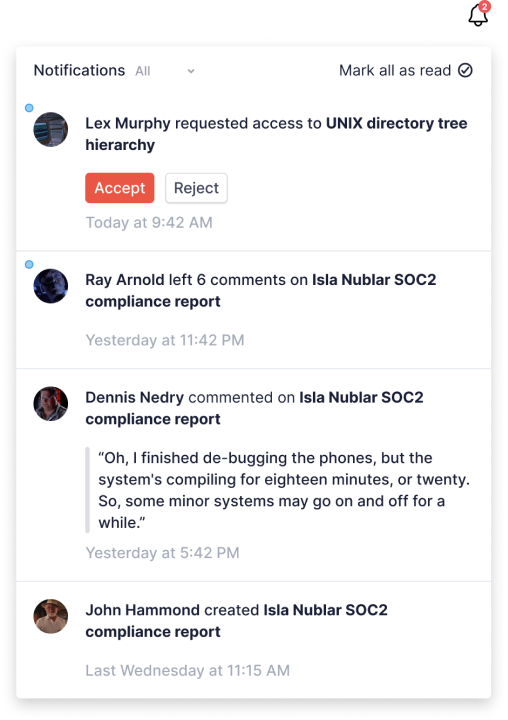

# React notification feed

A set of components for integrating a Knock in-app feed into a React application.

[See a live demo](https://knock-in-app-notifications-react.vercel.app/)



**Note: these components are currently designed to be used in conjunction with the Knock in-app feed
channel, and via React for web only.**

[Full documentation](https://docs.knock.app/in-app-ui/react/overview)

## Installation

Via NPM:

```
npm install @knocklabs/react-notification-feed
```

Via Yarn:

```
yarn add @knocklabs/react-notification-feed
```

## Configuration

To configure the feed you will need:

1. A public API key (found in the Knock dashboard)
2. A feed channel ID (found in the Knock dashboard)
3. A user ID, and optionally an auth token for production environments

## Usage

You can integrate the feed into your app as follows:

```jsx
import {
  KnockFeedProvider,
  NotificationIconButton,
  NotificationFeedPopover,
} from "@knocklabs/react-notification-feed";

// Required CSS import, unless you're overriding the styling
import "@knocklabs/react-notification-feed/dist/index.css";

const YourAppLayout = () => {
  const [isVisible, setIsVisible] = useState(false);
  const notifButtonRef = useRef(null);

  return (
    <KnockFeedProvider
      apiKey={process.env.KNOCK_PUBLIC_API_KEY}
      feedId={process.env.KNOCK_FEED_ID}
      userId={currentUser.id}
    >
      <>
        <NotificationIconButton
          ref={notifButtonRef}
          onClick={(e) => setIsVisible(!isVisible)}
        />
        <NotificationFeedPopover
          buttonRef={notifButtonRef}
          isVisible={isVisible}
          onClose={() => setIsVisible(false)}
        />
      </>
    </KnockFeedProvider>
  );
};
```

## Headless usage

Alternatively, if you don't want to use our components you can render the feed in a headless mode using our hooks:

```jsx
import {
  useAuthenticatedKnockClient,
  useNotifications,
} from "@knocklabs/react-notification-feed";
import create from "zustand";

const YourAppLayout = () => {
  const knockClient = useAuthenticatedKnockClient(
    process.env.KNOCK_PUBLIC_API_KEY,
    currentUser.id
  );

  const notificationFeed = useNotifications(
    knockClient,
    process.env.KNOCK_FEED_ID
  );

  const useNotificationStore = create(notificationFeed.store);
  const { metadata } = useNotificationStore();

  useEffect(() => {
    notificationFeed.fetch();
  }, [notificationFeed]);

  return <span>Total unread: {metadata.unread_count}</span>;
};
```
